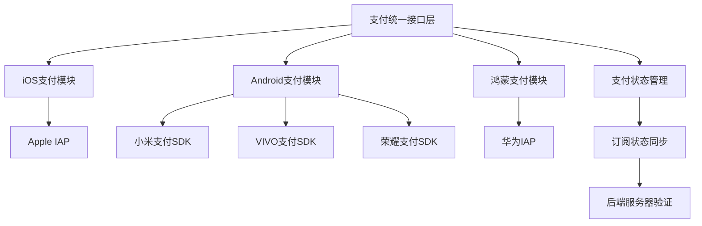
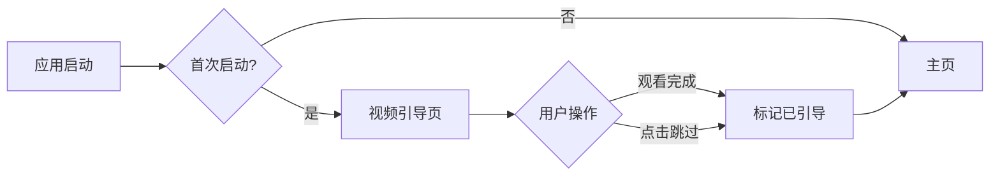

# WOR排气声浪 - 多端支付订阅与视频引导页开发方案

## 一、需求分析

### 需求1：多端支付订阅功能
- **iOS端**：Apple IAP 订阅支付（已有 sn-uts-iap 模块基础）
- **Android端**：
  - 小米应用商店支付
  - VIVO应用商店支付
  - 荣耀应用商店支付
- **鸿蒙端**：华为应用市场支付

### 需求2：视频引导页
- 首次启动展示视频引导
- 支持跳过功能
- 引导完成后进入主页
- 记录用户是否已观看

### 需求3：多渠道打包
- iOS App Store
- Android 各厂商应用商店（小米、VIVO、荣耀）
- 鸿蒙应用市场

---

## 二、技术架构设计

### 2.1 多端支付架构



### 2.2 视频引导页架构



---

## 三、项目目录结构规划

```
uniapp-worB/
├── pages/
│   ├── index/                    # 主页
│   ├── friend/                   # 朋友页
│   ├── startpage/                # 启动页（现有）
│   ├── guide/                    # 新增：视频引导页
│   │   └── guide.vue
│   └── payment/                  # 新增：支付相关页面
│       ├── subscription.vue      # 订阅页面
│       └── payment-result.vue    # 支付结果页
│
├── uni_modules/
│   ├── sn-uts-iap/              # iOS支付模块（已有）
│   ├── wor-payment/             # 新增：统一支付模块
│   │   ├── index.ts             # 统一支付接口
│   │   ├── ios/                 # iOS支付实现
│   │   ├── android/             # Android支付实现
│   │   │   ├── xiaomi/          # 小米支付
│   │   │   ├── vivo/            # VIVO支付
│   │   │   └── honor/           # 荣耀支付
│   │   └── harmony/             # 鸿蒙支付实现
│   └── wor-guide/               # 新增：引导页模块
│       ├── index.ts
│       └── components/
│           └── video-guide.vue
│
├── store/                        # 新增：状态管理
│   ├── index.ts
│   ├── modules/
│   │   ├── payment.ts           # 支付状态
│   │   ├── subscription.ts      # 订阅状态
│   │   └── user.ts              # 用户状态
│
├── utils/                        # 新增：工具函数
│   ├── payment/
│   │   ├── index.ts             # 支付工具入口
│   │   ├── validator.ts         # 支付验证
│   │   └── channel.ts           # 渠道识别
│   ├── storage.ts               # 本地存储封装
│   └── logger.ts                # 日志工具
│
├── api/                          # 新增：API接口
│   ├── payment.ts               # 支付相关接口
│   ├── subscription.ts          # 订阅相关接口
│   └── user.ts                  # 用户相关接口
│
├── config/                       # 新增：配置文件
│   ├── payment.config.ts        # 支付配置
│   ├── channel.config.ts        # 渠道配置
│   └── app.config.ts            # 应用配置
│
├── static/
│   ├── video/                   # 新增：引导视频
│   │   └── guide.mp4
│   └── image/
│
├── build/                        # 新增：打包配置
│   ├── channels/                # 渠道配置
│   │   ├── ios.json
│   │   ├── xiaomi.json
│   │   ├── vivo.json
│   │   ├── honor.json
│   │   └── harmony.json
│   └── scripts/                 # 打包脚本
│       └── build-channels.js
│
└── manifest.json                # 应用配置（需更新）
```

---

## 四、详细技术方案

### 4.1 多端支付订阅实现方案

#### 4.1.1 统一支付接口设计

```typescript
// uni_modules/wor-payment/index.ts
export interface PaymentConfig {
  productId: string;        // 商品ID
  productName: string;      // 商品名称
  price: number;            // 价格
  currency: string;         // 货币单位
  subscriptionPeriod?: string; // 订阅周期
}

export interface PaymentResult {
  success: boolean;
  orderId?: string;
  transactionId?: string;
  error?: string;
}

export interface IPaymentService {
  init(): Promise<boolean>;
  getProducts(productIds: string[]): Promise<any[]>;
  purchase(config: PaymentConfig): Promise<PaymentResult>;
  subscribe(config: PaymentConfig): Promise<PaymentResult>;
  restorePurchases(): Promise<any[]>;
  getSubscriptionStatus(): Promise<any>;
  validateReceipt(receipt: string): Promise<boolean>;
}
```

#### 4.1.2 iOS支付实现（基于现有 sn-uts-iap）

```typescript
// uni_modules/wor-payment/ios/index.ts
import { 
  initConnection, 
  getItems, 
  buyProduct,
  subscriptionStatus,
  validateReceiptIOS 
} from '@/uni_modules/sn-uts-iap';

export class IOSPaymentService implements IPaymentService {
  async init(): Promise<boolean> {
    return initConnection();
  }
  
  async subscribe(config: PaymentConfig): Promise<PaymentResult> {
    // 调用 sn-uts-iap 的订阅功能
    const result = await buyProduct(config.productId);
    return {
      success: result.success,
      transactionId: result.transactionId
    };
  }
  
  // ... 其他方法实现
}
```

#### 4.1.3 Android各厂商支付实现

##### 小米支付
```typescript
// uni_modules/wor-payment/android/xiaomi/index.ts
export class XiaomiPaymentService implements IPaymentService {
  // 集成小米游戏中心SDK
  // 使用 UTS 插件封装原生小米支付API
}
```

##### VIVO支付
```typescript
// uni_modules/wor-payment/android/vivo/index.ts
export class VivoPaymentService implements IPaymentService {
  // 集成VIVO开放平台SDK
  // 使用 UTS 插件封装原生VIVO支付API
}
```

##### 荣耀支付
```typescript
// uni_modules/wor-payment/android/honor/index.ts
export class HonorPaymentService implements IPaymentService {
  // 集成荣耀应用市场SDK
  // 使用 UTS 插件封装原生荣耀支付API
}
```

#### 4.1.4 鸿蒙支付实现

```typescript
// uni_modules/wor-payment/harmony/index.ts
export class HarmonyPaymentService implements IPaymentService {
  // 集成华为IAP SDK
  // 使用 UTS 插件封装鸿蒙支付API
}
```

#### 4.1.5 支付工厂模式

```typescript
// uni_modules/wor-payment/factory.ts
export class PaymentFactory {
  static createPaymentService(): IPaymentService {
    // #ifdef APP-IOS
    return new IOSPaymentService();
    // #endif
    
    // #ifdef APP-ANDROID
    const channel = getChannel(); // 获取渠道标识
    switch(channel) {
      case 'xiaomi':
        return new XiaomiPaymentService();
      case 'vivo':
        return new VivoPaymentService();
      case 'honor':
        return new HonorPaymentService();
      default:
        throw new Error('不支持的渠道');
    }
    // #endif
    
    // #ifdef APP-HARMONY
    return new HarmonyPaymentService();
    // #endif
  }
}
```

### 4.2 视频引导页实现方案

#### 4.2.1 引导页组件设计

```vue
<!-- uni_modules/wor-guide/components/video-guide.vue -->
<template>
  <view class="guide-container">
    <video 
      :src="videoSrc"
      :controls="false"
      :autoplay="true"
      :show-center-play-btn="false"
      @ended="onVideoEnded"
      class="guide-video"
    />
    
    <view class="skip-btn" @click="onSkip">
      跳过 {{ countdown > 0 ? `(${countdown}s)` : '' }}
    </view>
    
    <view class="indicator">
      <view 
        v-for="(item, index) in videos" 
        :key="index"
        :class="['dot', { active: currentIndex === index }]"
      />
    </view>
  </view>
</template>
```

#### 4.2.2 引导页逻辑

```typescript
// pages/guide/guide.vue
import { ref, onMounted } from 'vue';
import { onLoad } from '@dcloudio/uni-app';

const hasShownGuide = ref(false);
const currentVideoIndex = ref(0);
const videos = ['/static/video/guide.mp4'];

onLoad(() => {
  // 检查是否已展示过引导
  const shown = uni.getStorageSync('hasShownGuide');
  if (shown) {
    navigateToHome();
  }
});

const onVideoEnded = () => {
  if (currentVideoIndex.value < videos.length - 1) {
    currentVideoIndex.value++;
  } else {
    finishGuide();
  }
};

const onSkip = () => {
  finishGuide();
};

const finishGuide = () => {
  uni.setStorageSync('hasShownGuide', true);
  navigateToHome();
};

const navigateToHome = () => {
  uni.reLaunch({
    url: '/pages/index/index'
  });
};
```

### 4.3 订阅状态管理

```typescript
// store/modules/subscription.ts
import { defineStore } from 'pinia';

export const useSubscriptionStore = defineStore('subscription', {
  state: () => ({
    isSubscribed: false,
    subscriptionType: '', // 订阅类型：月度、年度等
    expirationDate: '',
    products: [],
    currentPlan: null
  }),
  
  actions: {
    async checkSubscriptionStatus() {
      const paymentService = PaymentFactory.createPaymentService();
      const status = await paymentService.getSubscriptionStatus();
      this.isSubscribed = status.isActive;
      this.expirationDate = status.expirationDate;
    },
    
    async loadProducts() {
      const paymentService = PaymentFactory.createPaymentService();
      this.products = await paymentService.getProducts([
        'com.wor.monthly',
        'com.wor.yearly'
      ]);
    },
    
    async subscribe(productId: string) {
      const paymentService = PaymentFactory.createPaymentService();
      const result = await paymentService.subscribe({
        productId,
        // ... 其他配置
      });
      
      if (result.success) {
        await this.checkSubscriptionStatus();
      }
      
      return result;
    }
  }
});
```

---

## 五、渠道打包方案

### 5.1 渠道配置文件

#### iOS配置
```json
// build/channels/ios.json
{
  "platform": "ios",
  "appId": "__UNI__DBE7390",
  "bundleId": "com.wor.exhaust",
  "payment": {
    "provider": "apple",
    "products": [
      {
        "id": "com.wor.monthly",
        "type": "subscription"
      }
    ]
  }
}
```

#### 小米配置
```json
// build/channels/xiaomi.json
{
  "platform": "android",
  "channel": "xiaomi",
  "appId": "__UNI__DBE7390_XIAOMI",
  "packageName": "com.wor.exhaust.xiaomi",
  "payment": {
    "provider": "xiaomi",
    "appKey": "YOUR_XIAOMI_APP_KEY",
    "appSecret": "YOUR_XIAOMI_APP_SECRET"
  }
}
```

#### VIVO配置
```json
// build/channels/vivo.json
{
  "platform": "android",
  "channel": "vivo",
  "appId": "__UNI__DBE7390_VIVO",
  "packageName": "com.wor.exhaust.vivo",
  "payment": {
    "provider": "vivo",
    "appKey": "YOUR_VIVO_APP_KEY",
    "appSecret": "YOUR_VIVO_APP_SECRET"
  }
}
```

#### 荣耀配置
```json
// build/channels/honor.json
{
  "platform": "android",
  "channel": "honor",
  "appId": "__UNI__DBE7390_HONOR",
  "packageName": "com.wor.exhaust.honor",
  "payment": {
    "provider": "honor",
    "appKey": "YOUR_HONOR_APP_KEY",
    "appSecret": "YOUR_HONOR_APP_SECRET"
  }
}
```

#### 鸿蒙配置
```json
// build/channels/harmony.json
{
  "platform": "harmony",
  "channel": "huawei",
  "appId": "__UNI__DBE7390_HARMONY",
  "packageName": "com.wor.exhaust.harmony",
  "payment": {
    "provider": "huawei",
    "appKey": "YOUR_HUAWEI_APP_KEY",
    "appSecret": "YOUR_HUAWEI_APP_SECRET"
  }
}
```

### 5.2 打包脚本

```javascript
// build/scripts/build-channels.js
const fs = require('fs');
const path = require('path');

const channels = ['ios', 'xiaomi', 'vivo', 'honor', 'harmony'];

channels.forEach(channel => {
  const config = require(`../channels/${channel}.json`);
  
  // 1. 更新 manifest.json
  updateManifest(config);
  
  // 2. 复制渠道特定资源
  copyChannelResources(channel);
  
  // 3. 执行打包命令
  buildChannel(channel, config);
});

function updateManifest(config) {
  const manifestPath = path.join(__dirname, '../../manifest.json');
  const manifest = JSON.parse(fs.readFileSync(manifestPath, 'utf-8'));
  
  // 更新 appid
  manifest.appid = config.appId;
  
  // 更新平台特定配置
  if (config.platform === 'android') {
    manifest['app-plus'].distribute.android.packagename = config.packageName;
  }
  
  fs.writeFileSync(manifestPath, JSON.stringify(manifest, null, 2));
}

function copyChannelResources(channel) {
  // 复制渠道特定的图标、启动图等资源
}

function buildChannel(channel, config) {
  // 调用 HBuilderX CLI 或使用 uni-app 打包命令
  console.log(`Building ${channel} package...`);
}
```

### 5.3 渠道识别工具

```typescript
// utils/payment/channel.ts
export function getChannel(): string {
  // #ifdef APP-IOS
  return 'ios';
  // #endif
  
  // #ifdef APP-ANDROID
  // 通过包名或其他标识识别渠道
  const packageName = plus.runtime.appid;
  if (packageName.includes('xiaomi')) return 'xiaomi';
  if (packageName.includes('vivo')) return 'vivo';
  if (packageName.includes('honor')) return 'honor';
  return 'android';
  // #endif
  
  // #ifdef APP-HARMONY
  return 'harmony';
  // #endif
  
  return 'unknown';
}

export function getChannelConfig() {
  const channel = getChannel();
  return require(`@/config/channels/${channel}.json`);
}
```

---

## 六、开发流程规划

### 阶段一：基础架构搭建（3-5天）
1. 创建项目目录结构
2. 搭建统一支付接口层
3. 配置状态管理（Pinia）
4. 创建工具函数和配置文件

### 阶段二：视频引导页开发（2-3天）
1. 设计引导页UI
2. 实现视频播放功能
3. 实现跳过和完成逻辑
4. 集成到启动流程

### 阶段三：iOS支付开发（3-4天）
1. 完善 iOS IAP 集成
2. 实现订阅购买流程
3. 实现收据验证
4. 测试沙盒环境

### 阶段四：Android各厂商支付开发（10-15天）
1. 小米支付集成（3-4天）
   - 创建 UTS 插件
   - 封装小米支付SDK
   - 实现支付流程
   - 测试验证

2. VIVO支付集成（3-4天）
   - 创建 UTS 插件
   - 封装VIVO支付SDK
   - 实现支付流程
   - 测试验证

3. 荣耀支付集成（3-4天）
   - 创建 UTS 插件
   - 封装荣耀支付SDK
   - 实现支付流程
   - 测试验证

### 阶段五：鸿蒙支付开发（4-5天）
1. 创建鸿蒙 UTS 插件
2. 封装华为IAP SDK
3. 实现支付流程
4. 测试验证

### 阶段六：订阅管理页面开发（3-4天）
1. 设计订阅页面UI
2. 实现商品列表展示
3. 实现购买流程
4. 实现订阅状态管理

### 阶段七：渠道打包配置（2-3天）
1. 配置各渠道参数
2. 编写打包脚本
3. 测试各渠道包

### 阶段八：测试与优化（5-7天）
1. 功能测试
2. 兼容性测试
3. 支付流程测试
4. 性能优化
5. Bug修复

---

## 七、技术难点与解决方案

### 7.1 多端支付SDK集成
**难点**：各厂商SDK接口不统一，需要分别封装

**解决方案**：
- 使用 UTS 插件封装原生SDK
- 设计统一的支付接口层
- 使用工厂模式根据平台创建对应实现

### 7.2 订阅状态同步
**难点**：用户可能在多设备使用，订阅状态需要同步

**解决方案**：
- 每次启动时检查订阅状态
- 实现服务器端收据验证
- 使用本地缓存 + 服务器验证的双重机制

### 7.3 视频资源优化
**难点**：引导视频可能较大，影响包体积

**解决方案**：
- 压缩视频文件（建议控制在5MB以内）
- 使用H.264编码，降低码率
- 考虑首次启动时从CDN下载（可选）

### 7.4 渠道包管理
**难点**：多个渠道包的配置和打包管理复杂

**解决方案**：
- 使用配置文件管理渠道参数
- 编写自动化打包脚本
- 使用条件编译区分不同渠道代码

---

## 八、注意事项

### 8.1 支付相关
1. 各平台需要先申请开发者账号和支付权限
2. 测试时使用沙盒环境，避免真实扣费
3. 实现完整的支付回调和异常处理
4. 做好支付日志记录，便于问题排查
5. 收据验证必须在服务器端进行

### 8.2 引导页相关
1. 视频文件大小控制在合理范围
2. 提供跳过按钮，避免强制观看
3. 记录用户是否已观看，避免重复展示
4. 考虑网络异常情况的处理

### 8.3 渠道打包相关
1. 不同渠道的包名、签名要区分
2. 各渠道的资源文件（图标等）要符合规范
3. 注意各应用商店的审核要求
4. 做好版本号管理

---

## 九、所需资源

### 9.1 开发资源
- 各厂商开发者账号
- 支付权限申请
- 测试设备（iOS、Android各厂商、鸿蒙）
- 测试账号

### 9.2 技术资源
- 小米游戏中心SDK文档
- VIVO开放平台SDK文档
- 荣耀应用市场SDK文档
- 华为IAP SDK文档
- uni-app UTS插件开发文档

### 9.3 设计资源
- 引导视频素材
- 订阅页面UI设计
- 各渠道应用图标和启动图

---

## 十、风险评估

| 风险项 | 风险等级 | 应对措施 |
|--------|---------|---------|
| 各厂商SDK文档不完善 | 高 | 提前调研，准备备选方案 |
| 支付测试环境不稳定 | 中 | 做好日志记录，及时反馈问题 |
| 渠道审核不通过 | 中 | 提前了解审核规则，准备申诉材料 |
| 视频播放兼容性问题 | 低 | 使用标准格式，做好兼容性测试 |
| 订阅状态同步延迟 | 低 | 实现重试机制，提示用户刷新 |

---

## 十一、后续优化方向

1. 支持更多支付方式（微信、支付宝等）
2. 实现优惠券和促销活动
3. 添加订阅提醒功能
4. 优化引导页交互体验
5. 实现数据埋点和分析
6. 支持多语言国际化
