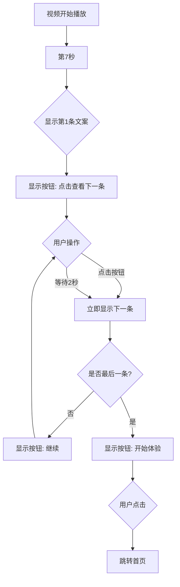

# 引导页视频交互优化方案

## 问题分析

当前 [`guide.vue`](../pages/guide/guide.vue) 存在的问题：

1. **按钮消失问题**：点击"继续"按钮后，`continueVisible` 立即设置为 `false`，导致按钮消失
2. **被动等待**：用户只能等待时间到达才能看到下一条文案，无法主动触发
3. **文案单一**：按钮文案始终是"点击继续"，缺乏引导性

## 需求说明

### 交互流程

```
视频开始播放
    ↓
第7秒：显示第1条文案 + "点击查看下一条"按钮
    ↓
用户点击按钮 OR 等待2秒
    ↓
显示第2条文案 + "继续"按钮
    ↓
用户点击按钮 OR 等待2秒
    ↓
显示第3条文案 + "继续"按钮
    ↓
... (重复)
    ↓
显示第5条文案（最后一条）+ "开始体验"按钮
    ↓
用户点击"开始体验"
    ↓
跳转到首页
```

### 按钮文案规则

- **第1条文案**：显示"点击查看下一条"
- **第2-4条文案**：显示"继续"
- **第5条文案（最后一条）**：显示"开始体验"

## 实现方案

### 核心逻辑修改

#### 1. 按钮显示逻辑

```javascript
// 当前问题：点击后立即隐藏
function onContinue() {
  continueVisible.value = false  // ❌ 导致按钮消失
}

// 修改方案：点击后显示下一条文案，按钮保持显示
function onContinue() {
  if (currentShownCount.value < copyLines.length) {
    currentShownCount.value++  // 立即显示下一条
    // continueVisible 保持 true，除非是最后一条
  } else {
    // 最后一条，点击后跳转
    finishGuide()
  }
}
```

#### 2. 动态按钮文案

```javascript
const buttonText = computed(() => {
  if (currentShownCount.value === 0) {
    return ''  // 还没开始显示文案
  } else if (currentShownCount.value === 1) {
    return '点击查看下一条'
  } else if (currentShownCount.value < copyLines.length) {
    return '继续'
  } else {
    return '开始体验'
  }
})
```

#### 3. 按钮显示条件

```javascript
// 当至少有一条文案显示时，按钮就应该显示
const continueVisible = computed(() => {
  return currentShownCount.value > 0
})
```

### 代码修改点

#### 修改 1：移除 `continueVisible` 的 ref 定义

```javascript
// 删除
const continueVisible = ref(false)

// 改为 computed
const continueVisible = computed(() => {
  return currentShownCount.value > 0
})
```

#### 修改 2：添加动态按钮文案

```javascript
const buttonText = computed(() => {
  if (currentShownCount.value === 0) {
    return ''
  } else if (currentShownCount.value === 1) {
    return '点击查看下一条'
  } else if (currentShownCount.value < copyLines.length) {
    return '继续'
  } else {
    return '开始体验'
  }
})
```

#### 修改 3：重写 `onContinue` 函数

```javascript
function onContinue() {
  if (currentShownCount.value < copyLines.length) {
    // 还有文案未显示，立即显示下一条
    currentShownCount.value++
  } else {
    // 所有文案已显示，点击后跳转首页
    finishGuide()
  }
}
```

#### 修改 4：调整 `syncByCurTime` 函数

```javascript
function syncByCurTime(cur) {
  // 只在时间到达时自动显示，不影响手动点击
  if (currentShownCount.value >= copyLines.length) return
  if (cur < startAt) return

  const desiredCount = Math.min(
    copyLines.length,
    Math.floor((cur - startAt) / stepInterval) + 1
  )

  if (desiredCount > currentShownCount.value) {
    currentShownCount.value = desiredCount
    // 移除这里的 continueVisible.value = true
  }
}
```

#### 修改 5：更新模板中的按钮文案

```vue
<view v-if="continueVisible" class="continue-wrap">
  <view class="continue-btn" @click="onContinue">{{ buttonText }}</view>
</view>
```

## 交互流程图



## 用户体验优化

### 优势

1. **主动控制**：用户可以主动点击查看下一条，不必被动等待
2. **清晰引导**：按钮文案随进度变化，给用户明确的操作提示
3. **灵活节奏**：既支持快速浏览（连续点击），也支持慢速观看（等待自动显示）
4. **明确结束**：最后一条显示"开始体验"，清晰告知用户可以进入应用

### 边界情况处理

1. **快速点击**：用户可以连续点击快速浏览所有文案
2. **视频结束**：如果视频播放完毕，自动跳转首页（保持原有逻辑）
3. **iOS 兼容**：保持原有的定时器兜底机制，确保 iOS 上正常工作

## 实施步骤

1. ✅ 分析当前代码逻辑和问题
2. 修改 [`guide.vue`](../pages/guide/guide.vue) 文件
   - 将 `continueVisible` 改为 computed
   - 添加 `buttonText` computed
   - 重写 `onContinue` 函数
   - 调整 `syncByCurTime` 函数
   - 更新模板中的按钮文案绑定
3. 测试交互流程
   - 测试点击快速浏览
   - 测试等待自动显示
   - 测试最后一条点击跳转
   - 测试视频结束自动跳转

## 代码变更摘要

| 文件 | 变更类型 | 说明 |
|------|---------|------|
| [`pages/guide/guide.vue`](../pages/guide/guide.vue) | 修改 | 优化按钮交互逻辑和文案显示 |

## 注意事项

1. 保持原有的定时器兜底机制，确保 iOS 兼容性
2. 不影响视频播放的流畅性
3. 按钮样式保持不变，只修改逻辑和文案
4. 确保 `pointer-events` 设置正确，按钮可点击
